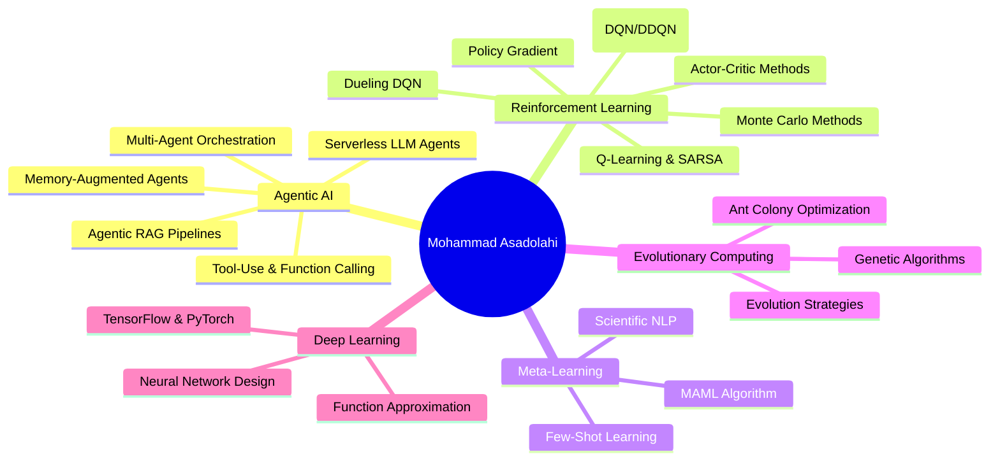

<!-- ═══════════════════════════════════════════════════════════════════ -->
<!--                        HEADER / HERO SECTION                       -->
<!-- ═══════════════════════════════════════════════════════════════════ -->

<p align="center">
  
</p>

<!-- Typing SVG -->
<p align="center">
  <a href="https://github.com/DenverCoder1/readme-typing-svg">
    
  </a>
</p>

<!-- Social Badges -->
<p align="center">
  <a href="https://github.com/MohammadAsadolahi?tab=followers">
    
  </a>
  <a href="https://github.com/MohammadAsadolahi?tab=repositories&sort=stargazers">
    
  </a>
  
</p>

<!-- ═══════════════════════════════════════════════════════════════════ -->
<!--                           ABOUT ME                                 -->
<!-- ═══════════════════════════════════════════════════════════════════ -->

##  &nbsp;About Me

```yaml
name: Mohammad Asadolahi
role: Senior Agentic AI Engineer
education:
  degree: PhD in Computer Science (In Progress)
  university: University of North Texas
  focus: Agentic AI Architectures & Reinforcement Learning

research_interests:
  - Multi-Agent LLM Orchestration & Tool-Use
  - Autonomous AI Agents & Agentic RAG
  - Reinforcement Learning (DQN, DDQN, Actor-Critic, SARSA)
  - Meta-Learning (MAML) for Few-Shot NLP
  - Evolutionary & Heuristic Optimization
  - Serverless AI Infrastructure

current_work:
  - Designing production-grade agentic LLM architectures
  - Building serverless AI agent pipelines on Cloudflare Workers
  - Contributing to mem0ai — memory layer for AI agents
  - Researching meta-learning for scientific claim detection

open_to: Research collaborations in Agentic AI & RL
```

<!-- ═══════════════════════════════════════════════════════════════════ -->
<!--                          TECH STACK                                -->
<!-- ═══════════════════════════════════════════════════════════════════ -->

## 🛠️ Tech Arsenal

<details open>
<summary><b>🤖 AI / ML / Agents</b></summary>
<br/>
<p>
  
  
  
  
  
  
  
  
  
  
  
  
</p>
</details>

<details open>
<summary><b>💻 Languages & Frameworks</b></summary>
<br/>
<p>
  
  
  
  
  
  
  
  
</p>
</details>

<details open>
<summary><b>☁️ Infrastructure & DevOps</b></summary>
<br/>
<p>
  
  
  
  
  
  
  
  
  
  
  
  
</p>
</details>

<!-- ═══════════════════════════════════════════════════════════════════ -->
<!--                       GITHUB STATS                                 -->
<!-- ═══════════════════════════════════════════════════════════════════ -->

## 📊 GitHub Analytics

<p align="center">
  <a href="https://github.com/DenverCoder1/github-readme-streak-stats">
    
  </a>
  <a href="https://github.com/anuraghazra/github-readme-stats">
    
  </a>
</p>

<p align="center">
  <a href="https://github.com/anuraghazra/github-readme-stats">
    
  </a>
</p>

<!-- Activity Graph -->
<p align="center">
  <a href="https://github.com/ashutosh00710/github-readme-activity-graph">
    
  </a>
</p>

<!-- GitHub Trophies -->
<p align="center">
  <a href="https://github.com/ryo-ma/github-profile-trophy">
    
  </a>
</p>

<!-- Snake Animation -->
<picture>
  <source media="(prefers-color-scheme: dark)" srcset="https://raw.githubusercontent.com/MohammadAsadolahi/MohammadAsadolahi/output/github-snake-dark.svg" />
  <source media="(prefers-color-scheme: light)" srcset="https://raw.githubusercontent.com/MohammadAsadolahi/MohammadAsadolahi/output/github-snake.svg" />
  
</picture>

<!-- ═══════════════════════════════════════════════════════════════════ -->
<!--                   EXPERTISE & RESEARCH                             -->
<!-- ═══════════════════════════════════════════════════════════════════ -->

## 🎯 Domains of Expertise



<!-- ═══════════════════════════════════════════════════════════════════ -->
<!--                          CONNECT                                   -->
<!-- ═══════════════════════════════════════════════════════════════════ -->

## 🤝 Let's Connect

<p align="center">
  <a href="https://github.com/MohammadAsadolahi">
    
  </a>
  <a href="https://www.linkedin.com/in/mohammad-asadolahi/">
    
  </a>
  <a href="mailto:mohammad.asadolahi@outlook.com">
    
  </a>
</p>

<p align="center">
  <i>💡 "The best way to predict the future is to build the agents that shape it."</i>
</p>

<!-- ═══════════════════════════════════════════════════════════════════ -->

<p align="center">
  
</p>
